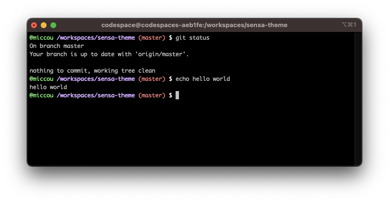

# sensa

An opinionated ZSH theme with Dracula colours built on a Risto base. Includes git status for repositories and will use your GitHub username when in codespaces.

# Development

To develop the theme on GitHub codespaces, start a codespace from your fork and run `./test.sh` once the codespace has started. This will install the theme (if not already done so) and activate a new ZSH prompt with the latest theme file. You can call `./test.sh` again for every change you make to see the effects of your work as you go.